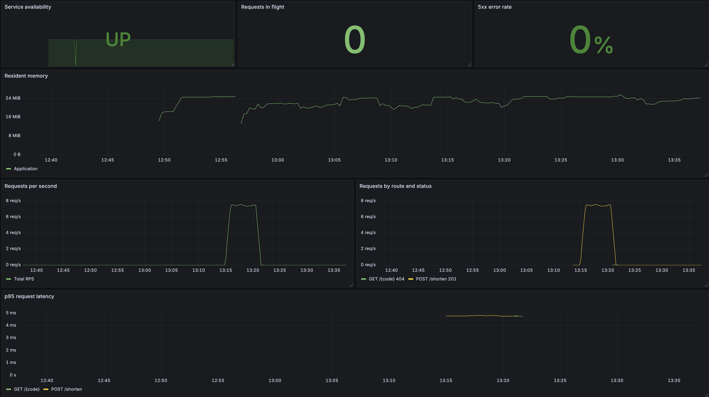

# PT Shortener

**Автор:** Вадим Лезинов

HTTP-сервис сокращения ссылок по [тестовому заданию](docs/ТЗ_EDR_стажировка.pdf). Сервис создаёт короткий код для HTTP(S)-URL и перенаправляет по нему на исходный адрес. Данные сохраняются в PostgreSQL; метрики доступны в Prometheus и на готовом дашборде Grafana.

## Запуск

Требуется только Docker с Compose v2.

```bash
cp .env.example .env
docker compose up -d --build
docker compose ps
```

После запуска доступны:

| Компонент | Адрес |
|---|---|
| API | <http://localhost:8080> |
| Prometheus | <http://localhost:9090> |
| Grafana | <http://localhost:3000> (`admin` / `admin` по умолчанию) |

Compose собирает приложение, запускает PostgreSQL, применяет миграции и поднимает весь стек мониторинга. Готовность API проверяется командой:

```bash
curl -i http://localhost:8080/readyz
```

Остановка без удаления данных:

```bash
docker compose down
```

## API

Создать короткую ссылку:

```bash
curl -i \
  -H 'Content-Type: application/json' \
  -d '{"url":"https://example.com"}' \
  http://localhost:8080/shorten
```

Ответ `201 Created`:

```json
{"short_url":"http://localhost:8080/Ab3kLm9Q"}
```

Перейти по полученному коду:

```bash
curl -i http://localhost:8080/Ab3kLm9Q
```

Ответ `302 Found` содержит исходный URL в заголовке `Location`. Дополнительные служебные маршруты: `GET /healthz`, `GET /readyz` и `GET /metrics`.

## Архитектура

```text
Client -> middleware -> HTTP handler -> shortener service -> repository -> PostgreSQL
Application /metrics <-scrape- Prometheus <-query- Grafana
```

- `cmd/shortener` – сборка зависимостей, запуск HTTP-сервера и graceful shutdown;
- `internal/httpapi` – маршруты, JSON-контракт и middleware;
- `internal/shortener` – бизнес-логика, валидация URL и генерация кода;
- `internal/storage/postgres` – реализация репозитория через PostgreSQL;
- `migrations` и `deployments` – схема БД и конфигурация мониторинга.

Зависимости направлены внутрь: бизнес-логика знает только интерфейс `Repository`, поэтому HTTP и PostgreSQL можно тестировать и заменять независимо.

### Дашборд Grafana


## Выбор технологий

| Технология | Причина выбора |
|---|---|
| Go 1.25 и `net/http` | Небольшой стандартный стек, строгая типизация и простая конкурентная модель |
| PostgreSQL 17 и `pgx` | Надёжное хранение, пул соединений и атомарная уникальность короткого кода |
| Base62 + `crypto/rand` | URL-безопасный восьмисимвольный код; коллизии обрабатываются повторной генерацией |
| `golang-migrate` | Версионируемая схема БД, автоматически применяемая перед запуском API |
| Prometheus и Grafana | Метрики RPS, ошибок, latency и ресурсов с автоматически загружаемым дашбордом |
| Docker Compose | Воспроизводимый запуск приложения и инфраструктуры одной командой |

## Оценка качества

На текущей версии проекта получены следующие результаты:

| Проверка | Результат |
|---|---|
| Unit-тесты | 67 тестов, все пройдены |
| Интеграционные тесты PostgreSQL | 3 теста, все пройдены на отдельной БД `shortener_test` |
| Покрытие с интеграционными тестами | 72.5% всего проекта; 91.5–100% в основных пакетах бизнес-логики и HTTP |
| Race detector и `go vet` | Ошибок не обнаружено |
| `golangci-lint v2.12.2` | `0 issues` |
| Docker Compose | Конфигурация валидна; `/readyz` отвечает `200`, дашборд Grafana загружается автоматически |

Основная локальная проверка:

```bash
make check
make config
```

Эти же тесты, `go vet` и линтер запускаются в GitHub Actions для push и pull request в `main` и `develop`.
